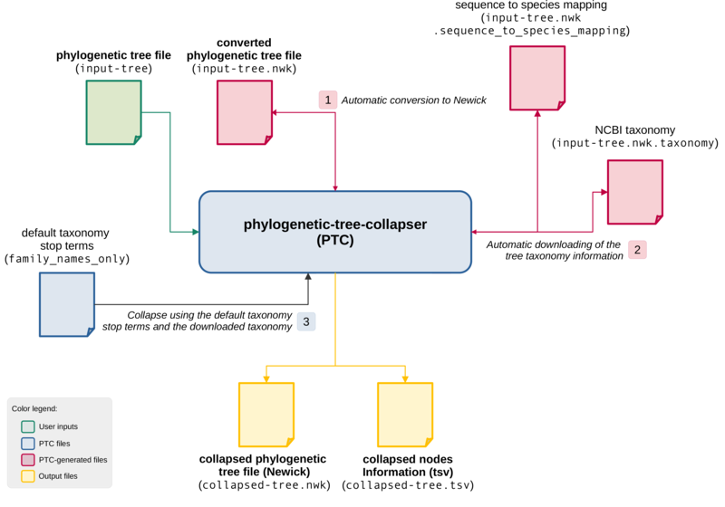
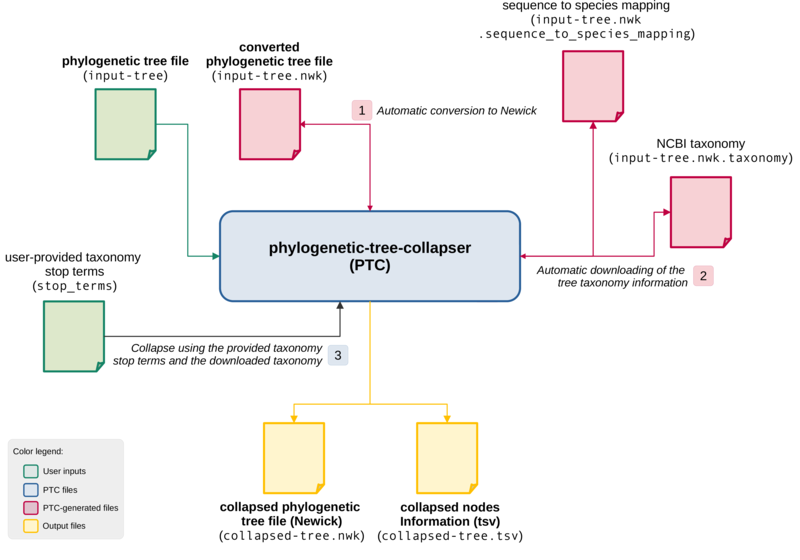
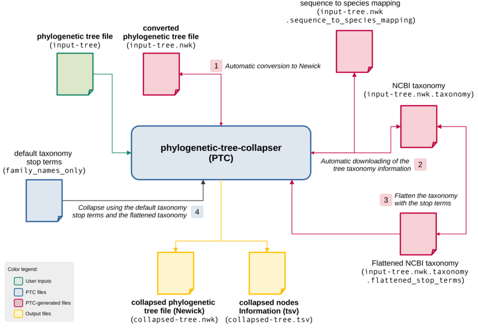
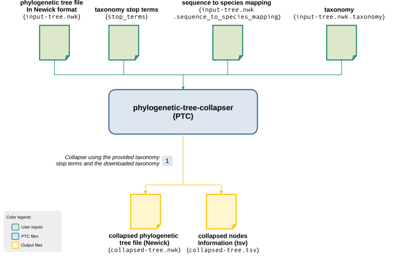

# Phylogenetic Tree Collapser [](https://github.com/pegi3s/phylogenetic-tree-collapser) [](https://hub.docker.com/r/pegi3s/phylogenetic-tree-collapser)
> **Phylogenetic Tree Collapser** (PTC) provides a simple and flexible way to collapse phylogenetic trees using taxonomic information. A Docker image is available for this utility in [this Docker Hub repository](https://hub.docker.com/r/pegi3s/phylogenetic-tree-collapser).

## Table of contents

   * [Input files](README.md#input-files)
   * [PTC collapsing procedure](README.md#ptc-collapsing-procedure)
   * [Running PTC](README.md#running-ptc)
   * [Test cases](README.md#test-cases)

# Input files

PTC uses the following input files:
- `--input`: a phylogenetic tree whose format is specified with `--input-format` (Newick, NEXUS, nexml, phyloxml, or cdao formats supported).
- `--sequence-mapping`: a tab-delimited file mapping each sequence name to its species. This file must have two columns: the first containing the sequence names of the input tree and the second one containing their corresponding species.
- `--taxonomy`: a plain-text file with the input taxonomy file. This file must have one line for each species with their taxonomy terms separated by semi-colons.
- `--taxonomy-stop-terms`: a plain-text file with the taxonomy stop terms file (one line for each stop term).

If the input file is in a format different to Newick, then the script converts it into Newick and saves it along with the original tree with `.nwk` extension.

If all sequence names in the input phylogenetic tree start with the species name (e.g. `Drosophila_melanogaster_fruit_fly_Drosophilidae_AAN09306.2`), then the sequence mapping and taxonomy files are optional. If not provided, the script will retrieve this information from the NCBI Databases using the Entrez utilities. In this case, the files are saved along with the input tree in Newick format with `.taxonomy` and `.sequence_to_species_mapping` extensions so that they can be reused in further analysis.

The taxonomy stop terms file is also optional. If not provided, the script will use as stop terms a list of predefined family names. This file can be shown with the following command: `docker run --rm pegi3s/phylogenetic-tree-collapser cat /opt/tree-collapser/data/family_names_only`.

# PTC collapsing procedure

For each possible pair of sibling nodes, PTC checks if they are collapsible or not based on the taxonomic information and the list of stop terms provided. Two sibling nodes are collapsible if they share a common ancestor in the taxonomy that is below a specified stop term. Consider two sequences belonging to _Drosophila_melanogaster_ and _Bactrocera_latifrons_ species and the following taxonomy:

```
Bactrocera_latifrons;Bactrocera;Bactrocera;Dacini;Dacinae;Tephritidae;Tephritoidea;Acalyptratae;Schizophora;Cyclorrhapha;Eremoneura;Muscomorpha;Brachycera;Diptera;Endopterygota;Neoptera;Pterygota;Dicondylia;Insecta;Hexapoda;Pancrustacea;Mandibulata;Arthropoda;Panarthropoda;Ecdysozoa;Protostomia;Bilateria;Eumetazoa;Metazoa;Opisthokonta;Eukaryota;cellular_organisms;
Drosophila_melanogaster;melanogaster_subgroup;melanogaster_group;Sophophora;Drosophila;Drosophilini;Drosophilinae;Drosophilidae;Ephydroidea;Acalyptratae;Schizophora;Cyclorrhapha;Eremoneura;Muscomorpha;Brachycera;Diptera;Endopterygota;Neoptera;Pterygota;Dicondylia;Insecta;Hexapoda;Pancrustacea;Mandibulata;Arthropoda;Panarthropoda;Ecdysozoa;Protostomia;Bilateria;Eumetazoa;Metazoa;Opisthokonta;Eukaryota;cellular_organisms;
```

If _Drosophilidae_ and _Tephritidae_ (families) are the stop terms list, then the two sequences are not collapsible. However, if only _Diptera_ (an order) is provided as stop term, then they are collapsed. In this case, the two nodes are collapsed into a single node, whose name is the one of the lowest common ancestor, _Acalyptratae_ in this case. The process continues until no more sibling nodes can be collapsed.

The output tree (`--output output.nwk`) generated with PTC can be a cladogram (`--output-type cladogram`) or a phylogram (`--output-type phylogram`) in Newick format. To obtain a phylogram, the input phylogenetic tree must include branch lengths. The names of the collapsed nodes have the following format: `<common_ancestor>_<group_name>_<number_of_nodes>`, where `<group_name>` is an auto-incremental index for disambiguation and `<number_of_nodes>` is the number of nodes under this collapsing. In addition, a tab-delimited file with the collapsed nodes (mapping collapsed node names to sequence names) is generated (`--output-collapsed-nodes collapsed_nodes.tsv`).

As explained above, the name of the collapsed nodes is the one of the lowest common ancestor below the stop terms. In some cases, you may be interested in having the stop terms as names of the collapsed nodes (e.g. you want to collapse a tree using only the family names as stop terms and have this family names in the collapsed tree). To do this, you can use the `--flatten-taxonomy-with-stop-terms` flag, which asks PTC to flatten the taxonomy using the list of stop terms provided. The flattened taxonomy is saved to `<input_taxonomy>.flattened_stop_terms`.

Consider the previous taxonomy of the _Drosophila_melanogaster_ and _Bactrocera_latifrons_ species. If we use _Drosophilidae_ and _Tephritidae_ (families) as stop terms, the flattened taxonomy would be:
```
Bactrocera_latifrons;Tephritidae;
Drosophila_melanogaster;Drosophilidae;
```

This way, sequences from the _Tephritidae_ family will be collapsed and appear under a node named `Tephritidae_<group_name>_<number_of_nodes>`.

# Running PTC

To run PTC, the Docker image that contains the script along with all its dependencies must be used. PTC requires Docker since it runs scripts and commands from other images to do its job ant therefore it requires additional parameters in the `docker run` command to allow the docker container to run other containers using the host's docker:

- `-v /var/run/docker.sock:/var/run/docker.sock`: mounts the `docker.sock` to give access to the host's docker.

The generic commands that you should adapt to run PTC is:
```
DATA_DIR=/path/to/data

docker run --rm -it -v /var/run/docker.sock:/var/run/docker.sock -v ~/.ptc-cache:/ptc-cache -v ${DATA_DIR}:/data pegi3s/phylogenetic-tree-collapser collapse-tree.py --input /data/input-tree --input-format newick --taxonomy-stop-terms /data/stop_terms --sequence-mapping /data/sequence_to_species_mapping --taxonomy /data/taxonomy --output /data/output-tree.nwk --output-type phylogram --output-collapsed-nodes /data/collapsed_nodes.tsv --input-path-host ${DATA_DIR}
```

As explained above and the test cases illustrate, some parameters are optional. Note that the `--input-path-host` is mandatory and must indicate the path in the host to the input files.

# Test cases

The input files for the test cases are the following:
- [diptera_tree.con](https://github.com/pegi3s/phylogenetic-tree-collapser/blob/master/test_data/diptera_tree.con): phylogenetic tree in NEXUS format.
- [stop_terms](https://github.com/pegi3s/phylogenetic-tree-collapser/blob/master/test_data/stop_terms): list of stop terms.

## 1. Providing only an input phylogenetic tree

The simplest case consists in providing only an input phylogenetic tree. As the image below shows, PTC first converts the input tree (named `input-tree`) into Newick format, saving it to `input-tree.nwk`. Second, it downloads the taxonomic information of each sequence from NCBI, saving it into `input-tree.nwk.taxonomy`. To do this, all sequence names in the input phylogenetic tree start with the species name (e.g. `Drosophila_melanogaster_fruit_fly_Drosophilidae_AAN09306.2` where species is `Drosophila_melanogaster`). In addition, PTC will also create the sequence to species mapping file in `input-tree.nwk.sequence_to_species_mapping`. At this point, all input files required for the tree collapsing have been generated, so PTC finally collapses it using as stop terms the default file that only contains the family names.



To execute this test case, you should adapt and run the following commands (just update `DATA_DIR`):
```
DATA_DIR=/path/to/data

docker run --rm -it -v /var/run/docker.sock:/var/run/docker.sock -v ~/.ptc-cache:/ptc-cache -v ${DATA_DIR}:/data pegi3s/phylogenetic-tree-collapser collapse-tree.py --input /data/diptera_tree.con --input-format nexus --output /data/collapsed_family_names_phylogram_diptera_tree.con.nwk --output-type phylogram --output-collapsed-nodes /data/collapsed_family_names_phylogram_diptera_tree.con.tsv --input-path-host ${DATA_DIR}
```

You can view the collapsed phylogenetic tree using a tool like MEGA X, for which we have a Docker image available [here](https://hub.docker.com/r/pegi3s/megax/).

## 2. Providing an input phylogenetic tree and a stop terms file

The second case consists in providing an input phylogenetic tree and a stop terms file. As the image below shows, this is the same as the previous case but using the user-provided stop terms file (`stop-terms` in the image) to collapse the tree.



To execute this test case, you should adapt and run the following commands (just update `DATA_DIR`):
```
DATA_DIR=/path/to/data

docker run --rm -it -v /var/run/docker.sock:/var/run/docker.sock -v ~/.ptc-cache:/ptc-cache -v ${DATA_DIR}:/data pegi3s/phylogenetic-tree-collapser collapse-tree.py --input /data/diptera_tree.con --input-format nexus --taxonomy-stop-terms /data/stop_terms --output /data/collapsed_phylogram_diptera_tree.con.nwk --output-type phylogram --output-collapsed-nodes /data/collapsed_phylogram_diptera_tree.con.tsv --input-path-host ${DATA_DIR}
```

## 3. Providing only an input phylogenetic tree and asking to flatten the taxonomy

The second case consists in providing an input phylogenetic tree and asking to flatten the taxonomy using the stop terms. As the image below shows, this is the same as the other two cases and the taxonomic information is automatically downloaded. However, instead of using the complete taxonomy, the `--flatten-taxonomy-with-stop-terms` is used to flatten it using the stop terms (not provided and therefore the default ones are used as in the first test case). The flattened taxonomy is saved to `input-tree.nwk.taxonomy.flattened_stop_terms`.



To execute this test case, you should adapt and run the following commands (just update `DATA_DIR`):
```
DATA_DIR=/path/to/data

docker run --rm -it -v /var/run/docker.sock:/var/run/docker.sock -v ~/.ptc-cache:/ptc-cache -v ${DATA_DIR}:/data pegi3s/phylogenetic-tree-collapser collapse-tree.py --input /data/diptera_tree.con --input-format nexus --output /data/collapsed_family_names_flatten_tax_phylogram_diptera_tree.con.nwk --output-type phylogram --output-collapsed-nodes /data/collapsed_family_names_flatten_tax_phylogram_diptera_tree.con.tsv --input-path-host ${DATA_DIR} --flatten-taxonomy-with-stop-terms
```

## 4. Providing all input files

In this fourth test case, the four input files are provided as the image below shows. Also, the input phylogenetic tree is provided in Newick format so no conversion is needed.



To execute this test case, you must have run the first use case previously so that the input files have already been generated. Then, you should adapt and run the following commands (just update `DATA_DIR`):
```
DATA_DIR=/path/to/data

docker run --rm -it -v /var/run/docker.sock:/var/run/docker.sock -v ~/.ptc-cache:/ptc-cache -v ${DATA_DIR}:/data pegi3s/phylogenetic-tree-collapser collapse-tree.py --input /data/diptera_tree.con.nwk --input-format newick --taxonomy-stop-terms /data/stop_terms --sequence-mapping /data/diptera_tree.con.nwk.sequence_to_species_mapping --taxonomy /data/diptera_tree.con.nwk.taxonomy --output /data/collapsed_phylogram_using_all_diptera_tree.con.nwk --output-type phylogram --output-collapsed-nodes /data/collapsed_phylogram_using_all_diptera_tree.con.tsv --input-path-host ${DATA_DIR}
```
